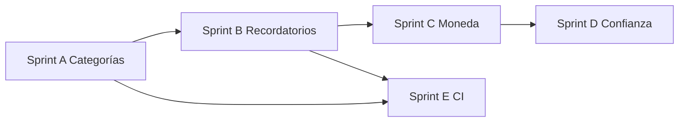

# Plan v1.2 — Gestor de Finanzas

> **Estado: v1.2 CERRADA** (16 jul 2026). Documento histórico.  
> Trabajo siguiente: [`PLAN-1.3.md`](PLAN-1.3.md) (Asesor IA de deudas).  
> Entregado: Sprints A (categorías), B (recordatorios), C (moneda), D2 (sesiones), E (CI + tests ownership). D1 (email verify) diferido a v1.3+.

Plan a partir del **MVP cerrado** ([`PLAN-DE-TRABAJO.md`](PLAN-DE-TRABAJO.md)).  
Objetivo: hacer el producto **más útil día a día y más confiable**, sin abrir dominios nuevos grandes.

> Tema: **“Más útil + más confiable”** — no “más módulos”.  
> Base: [`PLAN-DE-TRABAJO.md`](PLAN-DE-TRABAJO.md) · [`docs/CONTRATOS-API.md`](docs/CONTRATOS-API.md) · `backend/prisma/schema.prisma`

---

## Contexto (qué ya tenemos)

| Área | Estado en main |
|------|----------------|
| Auth, transacciones + sync saldos, cuentas | ✅ |
| Inversiones, deudas, recurrentes + cron | ✅ |
| Notificaciones, reportes/CSV, configuración real | ✅ |
| Metas, presupuestos + alertas | ✅ |
| Gamificación básica | ✅ |
| Categorías API | ✅ (UI Config + modales; fallback defaults) |
| Recordatorios | ✅ API + cron + UI |
| Sesiones (confianza) | ✅ Sprint D |
| Email verify | → v1.3 (D1 diferido) |
| Moneda principal | ✅ operativa en UI (trabajo reciente) |

---

## Principios v1.2

1. **Cerrar lo casi hecho** antes de inventar features.
2. **Un contrato por módulo** — actualizar `docs/CONTRATOS-API.md` al implementar.
3. **In-app primero** — email/SMTP solo si aporta; no bloquear el release.
4. **Sin simulaciones** — si no hay backend, no hay botón de éxito falso.
5. **Tests en lo sensible** — ownership, cron de recordatorios, formato de moneda.
6. **Fuera de scope** queda documentado (no se “olvida”, se pospone).

---

## Fuera de v1.2 (explícito)

- Análisis predictivo / IA
- Open Banking / sincronización bancaria
- App móvil nativa
- Auditoría completa de accesos (salvo lo mínimo si se toca sesiones)
- Redesign profundo de gamificación
- Multi-FX completo con proveedores de tasas en tiempo real

---

## Sprint A — Categorías de punta a punta (P0)

**Por qué:** API y service ya existen; la UI sigue hardcodeando `CATEGORIAS_DEFAULT`. Es el quick win con más impacto en transacciones, presupuestos y reportes.

### A.1 Backend (verificar / completar)

- [x] Revisar CRUD `/api/categorias` vs contrato real (listado, personalizadas, estadísticas).
- [x] Seed o endpoint de categorías sistema/default para no depender solo del frontend.
- [x] Ownership: categorías personalizadas solo del `req.user.id`.
- [x] Tests unitarios/integración mínimos de create/list/delete.

### A.2 Frontend

- [x] Página o sección en Configuración: CRUD de categorías personalizadas.
- [x] Reemplazar usos de `CATEGORIAS_DEFAULT` en modales (`ModalTransaccion`, presupuestos, filtros) por carga desde API + fallback seguro.
- [x] Usar categorías del usuario en reportes (filtros / breakdown).
- [x] Toasts de error/éxito reales (sin éxito simulado).

### A.3 Docs

- [x] Ampliar sección Categorías en `docs/CONTRATOS-API.md`.
- [x] Actualizar tabla de módulos en `README.md`.

**Criterio de salida:** crear/editar/eliminar categoría personalizada y usarla al crear un gasto; aparece en listados y reportes.

**Archivos clave (orientativos):**

- `backend/controllers/categoria.controller.js`, `backend/routes/categoria.routes.js`
- `frontend/src/services/categoria.service.js`
- `frontend/src/utils/constants.js`
- `frontend/src/components/transacciones/ModalTransaccion.jsx`
- Modales/páginas de presupuestos y reportes

---

## Sprint B — Recordatorios in-app (P0)

**Por qué:** modelo `Recordatorio` ya está en Prisma; encaja con notificaciones y deudas/metas.

### B.1 API

Modelo de referencia (`Recordatorio`):

| Campo | Notas |
|-------|--------|
| `titulo`, `descripcion?` | texto |
| `tipo` | enum `TipoRecordatorio` (Prisma) |
| `fechaRecordatorio` | DateTime |
| `repetir`, `frecuencia?` | recurrencia simple |
| `completado`, `activo` | estado |
| `userId` | ownership obligatorio |

- [x] CRUD `/api/sistema/recordatorios` (prefijo sistema, documentado).
- [x] `PUT .../completar` y `PUT .../reactivar` (convención PUT del API).
- [x] Filtros: `soloPendientes`, rango de fechas.
- [x] Validación Joi + ownership en get/update/delete.
- [x] Job/cron (o reutilizar patrón de recurrentes): al vencer, crear `Notificacion` in-app.
- [x] Tests: ownership + “no notificar dos veces el mismo recordatorio vencido”.

### B.2 UI

- [x] Página `/recordatorios` + enlace en Sidebar.
- [x] Modal crear/editar; acciones completar / desactivar.
- [x] (Opcional) chips o contador de pendientes junto a Notificaciones.

### B.3 Integraciones ligeras (si da tiempo en el mismo sprint)

- [x] Atajo “recordarme” desde una deuda (fecha ≈ vencimiento).
- [x] Atajo desde meta (fecha objetivo).

**Criterio de salida:** usuario crea recordatorio, lo ve en lista, al vencer recibe notificación in-app; solo ve los suyos.

**Archivos clave:**

- `backend/prisma/schema.prisma` (`Recordatorio`, `TipoRecordatorio`)
- `backend/jobs/` (patrón de `recurrentes`)
- `frontend/src/pages/`, `frontend/src/components/layout/` (Sidebar)

---

## Sprint C — Moneda y formato homogéneo (P1)

**Por qué:** `monedaPrincipal` ya es operativa; falta consistencia visual y reglas claras.

### C.1 Reglas de producto

Documentar en contratos:

1. La UI formatea montos con `user.monedaPrincipal` por defecto. ✅
2. Si una cuenta tiene `moneda` distinta, mostrar código de moneda en esa fila (no convertir en silencio). ✅
3. CSV export indica moneda usada. ✅
4. v1.2 **no** incluye proveedor de tasas en vivo (queda backlog 1.3). ✅

### C.2 Implementación

- [x] Utilidad única de formato (`formatMoney(monto, codigo)` en `currency.js` + `useCurrency`) usada en Dashboard, transacciones, deudas, inversiones, metas, presupuestos, reportes.
- [x] Revisar export CSV / reportes para incluir moneda.
- [x] Tests unitarios del formateador (locales / códigos comunes: USD, EUR, PEN, MXN, COP…).
- [x] Casos borde: `monedaPrincipal` inválida → fallback documentado (ej. USD).

**Criterio de salida:** no quedan montos “crudos” o con símbolo fijo distinto a la preferencia del usuario en pantallas principales.

**Archivos clave:**

- `frontend/src/utils/format.js` (o equivalente)
- Context/auth que expone `monedaPrincipal`
- Páginas de listado y Dashboard

---

## Sprint D — Confianza de cuenta (P1, elegir un eje)

Implementar **uno** de los dos ejes en v1.2; el otro pasa a 1.3 salvo que sobre capacidad.

**Implementado en v1.2: D2 (Sesiones).** D1 (email) → backlog 1.3.

### Opción D1 — Verificación de email (diferido v1.3)

Campo existente: `User.emailVerificado`.

- [ ] Generar token de verificación (tabla nueva mínima o JWT de un solo uso con expiración).
- [ ] `POST /api/auth/verify-email/request` y `POST /api/auth/verify-email/confirm`.
- [ ] Envío de email **solo si** hay SMTP configurado; si no, endpoint de dev documentado o log seguro.
- [ ] UI: banner “verifica tu email” + pantalla de confirmación.
- [ ] No bloquear el uso del resto de la app en v1.2 (soft gate).

### Opción D2 — Sesiones básicas ✅

Modelo existente: `SesionUsuario`.

- [x] Registrar sesión al login (token hash, dispositivo, IP, expiración).
- [x] `GET /api/auth/sessions` — listar sesiones activas del usuario.
- [x] `DELETE /api/auth/sessions/:id` — cerrar una; `DELETE /api/auth/sessions/others` cierra el resto.
- [x] UI en Configuración → Seguridad.
- [x] Invalidar token si la sesión está `activa: false` (middleware).

**Recomendación:** si el deploy es multi-dispositivo o compartido, priorizar **D2**. Si el dolor es onboarding/confianza de cuenta, **D1**.

**Criterio de salida:** el eje elegido funciona E2E sin éxito simulado; contratos documentados.

---

## Sprint E — Calidad y CI (P2, en paralelo o al cierre)

- [x] Tests de integración ownership (IDOR) con DB de test en CI (transacciones, recordatorios, categorías).
- [x] Incluir `frontend` lint (y opcionalmente `npm run build`) en `.github/workflows/ci.yml`.
- [x] Cobertura mínima documentada de mappers / saldos / recordatorios vencidos.
- [x] Revisar rate limit en rutas auth nuevas (verify-email / sessions).

**Criterio de salida:** CI falla si rompen ownership básico o el build del frontend.

---

## Orden recomendado

Orden estricto sugerido: **A → B → C → D**, con **E** enganchado al final de A/B (no dejarlo para “alguna vez”).

---

## Definición de “v1.2 terminada”

1. Categorías personalizadas usables en transacciones (y preferible en presupuestos/reportes).
2. Recordatorios CRUD + notificación in-app al vencer.
3. Montos formateados de forma coherente con `monedaPrincipal`.
4. Un eje de confianza (email **o** sesiones) operativo.
5. CI cubre tests backend (idealmente ownership) y lint/build frontend.
6. `README.md` y `docs/CONTRATOS-API.md` reflejan el estado real.
7. Nada de botones contra APIs inexistentes.

---

## Checklist de arranque por sesión

Al retomar este plan en otra sesión:

1. Leer este archivo y marcar qué sprint está activo.
2. Confirmar contratos del módulo en `docs/CONTRATOS-API.md` antes de codear UI.
3. Una PR por sprint (o por eje claro: categorías / recordatorios / moneda / confianza).
4. No mezclar D1 y D2 en la misma PR salvo que sea trivial.
5. Actualizar la tabla de módulos del `README.md` al cerrar cada sprint.

---

## Backlog candidato a v1.3 (→ ver [`PLAN-1.3.md`](PLAN-1.3.md))

| Idea | Notas |
|------|--------|
| Tasa de cambio simple (manual o API barata) | Solo si hay cuentas multi-moneda reales |
| Email en recordatorios / SMTP productivo | Depende de D1 o infra |
| El otro eje de confianza (D1/D2 restante) | |
| `AuditoriaAcceso` mínima (login fallido / password change) | |
| Refresh tokens | Si sesiones (D2) se quedan cortas |
| UI avanzada de reportes (comparar meses, budgets vs actual) | Sobre agregados ya existentes |
| Categorías con icono/color y drag order | Polish |

---

## Referencia rápida de prioridades

| Prioridad | Sprint | Entrega |
|-----------|--------|---------|
| P0 | A | Categorías UI + consumo real |
| P0 | B | Recordatorios in-app + cron → notificación |
| P1 | C | Formato/reglas de moneda |
| P1 | D | Email verify **o** sesiones |
| P2 | E | Tests integración + CI frontend |

---

## Cierre

Todos los criterios de “v1.2 terminada” se cumplieron (D1 email verify diferido a propósito).
El backlog candidato a v1.3 se retoma en [`PLAN-1.3.md`](PLAN-1.3.md).
