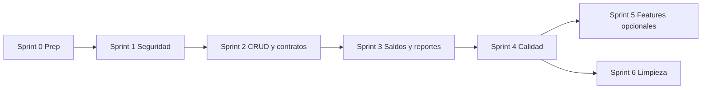

# Plan de trabajo — Gestor de Finanzas

> **Estado: MVP CERRADO** (Sprints 0–6 + Metas/Presupuestos).  
> Cadena histórica: MVP → [`PLAN-1.2.md`](PLAN-1.2.md) (cerrada) → [`PLAN-1.3.md`](PLAN-1.3.md) (activa).

Plan para cerrar el proyecto a partir de la auditoría completa. Objetivo: dejar el sistema **usable, consistente y seguro** para uso real con múltiples usuarios.

---

## Estado final (MVP)

| Área | Estado |
|------|--------|
| Auth (login / register / me / profile / password / preferences) | ✅ |
| Transacciones + sync de saldos | ✅ |
| Cuentas | ✅ |
| Inversiones | ✅ |
| Deudas | ✅ |
| Recurrentes + cron | ✅ |
| Notificaciones | ✅ |
| Gamificación | ✅ básica |
| Reportes / CSV | ✅ |
| Configuración | ✅ persistida |
| Metas / Presupuestos | ✅ |
| Categorías | ✅ API (UI completa → v1.2 Sprint A) |
| Recordatorios / Sesiones / Email verify | → [`PLAN-1.2.md`](PLAN-1.2.md) |

---

## Principios del plan

1. **Seguridad primero** — no avanzar features nuevas con IDOR o fugas de datos.
2. **Un contrato por módulo** — frontend, backend y Prisma deben usar los mismos nombres y enums.
3. **CRUD completo o UI limitada** — no dejar botones que llamen a endpoints inexistentes.
4. **Sin simulaciones** — si no está implementado, no mostrar éxito falso.
5. **Tests mínimos** en cada sprint crítico/alto.

---

## Sprint 0 — Preparación (0.5–1 día)

- [x] Crear rama `fix/auditoria-cierre` desde `main`.
- [x] Unificar puerto por defecto del backend a **5000** (alineado con `.env.example` y proxy Vite).
- [x] Crear singleton de Prisma (`backend/lib/prisma.js`) y migrar controladores.
- [x] Definir documento de contratos API (nombres de campos y enums por módulo) → [`docs/CONTRATOS-API.md`](docs/CONTRATOS-API.md).
- [x] Rehabilitar `notFoundHandler` en `app.js`.
- [x] Quitar logs de JWT/token en `auth.middleware.js`.

**Criterio de salida:** entorno estable, Prisma centralizado, sin tokens en consola.

---

## Sprint 1 — Críticos de seguridad y roturas (3–5 días)

### 1.1 Autorización (IDOR y alcance)

| ID | Tarea | Archivos clave |
|----|--------|----------------|
| C1 | Filtrar por `userId` en get/update/delete de transacciones | `transaccion.controller.js` |
| C2 | Filtrar ejecución de recurrentes por `req.user.id` | `transacciones-recurrentes.controller.js` |
| C3 | Forzar `userId = req.user.id` al crear notificaciones | mismo controlador |

- [x] Ownership en get/update/delete de transacciones.
- [x] Ejecutar recurrentes solo del usuario autenticado.
- [x] Crear notificaciones solo para `req.user.id`.
- [x] Tests unitarios de mappers (aliases UI ↔ Prisma).
- [x] Tests de integración ownership con DB → diferido a v1.2 Sprint E (CI).

### 1.2 Deudas (módulo roto)

| ID | Tarea |
|----|--------|
| C4 | Corregir parsing en `Deudas.jsx` → `response.deudas` |
| C5 | Implementar `POST /api/finanzas/deudas` |
| A4 | Unificar campos: `montoInicial` / `montoActual` (o DTO claro) |
| — | Añadir `PUT` y `DELETE` de deudas, o quitar botones hasta tenerlos |
| — | Alinear enums (`PRESTAMO_PERSONAL`, `OTRO`, etc.) |

- [x] Parsing `response.deudas`.
- [x] `POST` / `PUT` / `DELETE` deudas.
- [x] DTO con `montoTotal` / `montoPagado` + mapeo de enums.

### 1.3 Cuentas (payload y enums)

| ID | Tarea |
|----|--------|
| C6 | Unificar body de saldo: `nuevoSaldo` ↔ `saldoActual` |
| C7 | Mapear enums UI ↔ Prisma (`BANCO_AHORROS`, etc.) y campo `tipo` |
| — | Implementar `DELETE /cuentas/:id` o deshabilitar botón |

- [x] Aceptar `nuevoSaldo` o `saldoActual`; frontend envía `nuevoSaldo`.
- [x] Mapear `tipo` / aliases UI; UI usa enums Prisma.
- [x] `DELETE /cuentas/:id` (soft-delete `activa: false`).

### 1.4 Seguridad básica

| ID | Tarea |
|----|--------|
| C8 | Eliminar `console.log` de Authorization / token / decoded |
| — | Restringir CORS a origen del frontend en producción |
| — | Validar que `JWT_SECRET` sea obligatorio al arrancar |

- [x] C8 hecho en Sprint 0.
- [x] CORS restringido cuando `NODE_ENV=production`.
- [x] Fail-fast si falta `JWT_SECRET`.

**Criterio de salida:** no hay IDOR obvio; deudas y cuentas se pueden crear/listar sin 404 ni `NaN`; tokens no aparecen en logs.

---

## Sprint 2 — Contratos API y CRUD faltante (5–7 días)

### 2.1 Inversiones

- [x] Mapear `montoInvertido` / `valorActual` / `cantidad` ↔ UI.
- [x] Alinear enums (`FONDOS_MUTUOS`, `OTRO`).
- [x] Implementar `PUT` y `DELETE` `/finanzas/inversiones/:id`.
- [x] Corregir cálculos de rendimiento en `Inversiones.jsx`.

### 2.2 Recurrentes

- [x] `PUT /sistema/recurrentes/:id`
- [x] `DELETE /sistema/recurrentes/:id`
- [x] `PUT /sistema/recurrentes/:id/toggle` (o incluir `activa` en update)
- [x] Validación Joi create + update (`createRecurrenteSchema` / `updateRecurrenteSchema`).

### 2.3 Notificaciones

- [x] Usar `fechaEnvio` (o alias en respuesta) en UI.
- [x] Unificar filtro: `soloNoLeidas=true` vs `leida=false`.
- [x] Alinear tipos (`INFO`, `ALERTA`, …) con el enum Prisma.
- [x] Implementar `DELETE /sistema/notificaciones/:id`.
- [x] Enlace a Notificaciones en el Sidebar.

### 2.4 Gamificación

- [x] Adaptar frontend al contrato real + `GET /logros/resumen` y `/historial`.
- [x] Completar `verificarLogros` (más de “Primera Transacción”).
- [x] Actualizar `puntosAcumulados` y `nivel` en `User`.
- [x] Evitar división por cero si no hay logros.

### 2.5 Configuración (dejar de simular)

- [x] `PUT /api/auth/profile` + `updateProfileSchema`
- [x] `PUT /api/auth/change-password`
- [x] `PUT /api/auth/preferences` (persistir en `User.configuracion` / `monedaPrincipal`)
- [x] Ocultar/deshabilitar exportar y eliminar cuenta hasta Sprint 3

### 2.6 Login UX

- [x] Mostrar `message` del backend en `Login.jsx` (igual que Register).

**Criterio de salida:** cada botón de la UI llama a un endpoint existente; no hay mensajes de éxito falsos en Configuración; gamificación muestra datos reales.

---

## Sprint 3 — Consistencia financiera y reportes (4–6 días)

### 3.1 Sincronización de saldos

- [x] Al crear/editar/eliminar transacción, actualizar `saldoActual` de la cuenta en una `$transaction` de Prisma.
- [x] Validar que la cuenta pertenece al usuario.
- [x] Definir reglas para `TRANSFERENCIA` (origen/destino).
- [x] Tests unitarios de deltas de saldo.

### 3.2 Resumen y agregaciones

- [x] Resumen de listado de transacciones con `aggregate` sobre el `where` completo (no solo la página).
- [x] Endpoint(s) de reportes en backend (`/api/reportes`).
- [x] Corregir enums en reportes/categorías (`INGRESO` / `GASTO`).
- [x] Subir límite de paginación / endpoint de agregación dedicado.
- [x] Conectar “Exportar datos” de Configuración a CSV real.

### 3.3 Categorías

- [x] Montar rutas `/api/categorias` (listado + CRUD personalizadas + estadísticas).
- [x] Consumo completo en modales → diferido a v1.2 Sprint A (API lista; UI aún con defaults).

### 3.4 Validaciones

- [x] Unificar `metodoPago` (validator + frontend) con enum Prisma.
- [x] Joi en cuentas, inversiones, deudas y recurrentes.

**Criterio de salida:** saldos coherentes con transacciones; reportes correctos desde API; validaciones homogéneas.

---

## Sprint 4 — Automatización, calidad y deuda media (4–5 días)

### 4.1 Recurrentes automáticas

- [x] Job con `node-cron` (o worker) que ejecute pendientes sin depender del botón del usuario.
- [x] Endpoint interno protegido o solo cron; el botón UI puede quedar como “forzar ahora”.

### 4.2 Tests y CI

- [x] Crear `backend/tests/` (auth, ownership, saldos, recurrentes).
- [x] Asegurar que `npm test` pase.
- [x] (Opcional) GitHub Action básica: install + test + lint.

### 4.3 Errores y logging

- [x] Estandarizar controladores con `catchAsync` + `AppError`.
- [x] Reducir `console.error` a favor de Winston.
- [x] Toasts o mensajes de error visibles en frontend (no solo `console.error`).

### 4.4 Seguridad adicional

- [x] Rate limiting en `/auth/login` y `/auth/register`.
- [x] `helmet` en Express.
- [x] Refresh tokens / `SesionUsuario` → diferido a v1.2 Sprint D (confianza).

### 4.5 Roles

- [x] Usar `requireRole('ADMIN')` en rutas admin, o documentar que el rol es solo informativo.

**Criterio de salida:** tests verdes; recurrentes se ejecutan solas; errores consistentes.

---

## Sprint 5 — Features del schema aún no implementadas (opcional / backlog)

Priorizar solo lo que aporte valor de producto. El resto se puede **eliminar del schema** para reducir deuda.

| Módulo | Esfuerzo estimado | Notas |
|--------|-------------------|--------|
| Metas de ahorro | Medio | ✅ CRUD + aportes + UI |
| Presupuestos + alertas | Medio-Alto | ✅ CRUD + sync gastado + notificación |
| Recordatorios | Medio | → v1.2 Sprint B |
| Categorías personalizadas | Bajo-Medio | API MVP; UI → v1.2 Sprint A |
| Sesiones / auditoría en BD | Medio | → v1.2 Sprint D |
| Verificación de email | Medio | → v1.2 Sprint D |

**Hecho en Sprint 5:** Metas + Presupuestos (API `/api/finanzas/metas|presupuestos`, páginas UI, sync al crear/editar/eliminar gastos).

---

## Sprint 6 — Limpieza y documentación (1–2 días)

### Código muerto a eliminar o conectar

- [x] `frontend/src/services/categoria.service.js` — se mantiene (API montada en Sprint 3).
- [x] `frontend/src/hooks/useFetch.js` — eliminado (no usado).
- [x] `frontend/src/utils/constants.js` / `format.js` — corregidos y usados en modales.
- [x] Dependencia `clsx` eliminada (`cn` en format.js).
- [x] Controladores reportes/categorías — montados en Sprint 3.
- [x] Encoding corrupto en comentarios de recurrentes — limpio en Sprint 4 rewrite.

### Documentación

- [x] Actualizar `README.md` con estado real por módulo (quitar “análisis predictivo” si no existe).
- [x] Crear o restaurar `backend/README.md` (endpoints, env, seed).
- [x] Documentar enums y contratos de campos (`docs/CONTRATOS-API.md`).
- [x] Checklist de despliegue (PostgreSQL, migrate, seed, `JWT_SECRET`, CORS).

### UX menor

- [x] Página 404 en lugar de redirigir `*` a dashboard.
- [x] Botón “Buscar” en Transacciones: implementado (`search` + filtros).
- [x] Unificar props de `ConfirmDialog` (`type` vs `variant`).

**Criterio de salida:** repo limpio, README honesto, sin archivos huérfanos evidentes.

---

## Diferidos a v1.2 (cierre formal del MVP)

Estos ítems **no bloquean** el MVP; quedan explicitados en [`PLAN-1.2.md`](PLAN-1.2.md):

| Ítem MVP | Destino v1.2 |
|----------|--------------|
| Consumo de categorías en modales / CRUD UI | Sprint A |
| Recordatorios in-app + cron → notificación | Sprint B |
| Tests integración ownership (DB en CI) | Sprint E |
| Sesiones / refresh tokens / email verify | Sprint D |
| Formato homogéneo de moneda | Sprint C |

---

## Orden de ejecución (histórico)

---

## Definición de “proyecto terminado” (MVP cerrado) — cumplida

El proyecto se considera **terminado para MVP** cuando:

1. Un usuario solo puede ver y modificar **sus** datos.
2. Funcionan de punta a punta: **Auth, Transacciones, Cuentas, Inversiones, Deudas, Recurrentes, Notificaciones, Reportes básicos, Configuración real**.
3. Saldos de cuentas y transacciones están **sincronizados**.
4. No hay botones que llamen a APIs inexistentes ni éxitos simulados.
5. Enums y nombres de campos coinciden entre UI, API y BD.
6. Hay **tests mínimos** de auth y ownership (unitarios; integración DB → v1.2).
7. README refleja lo que realmente existe.

**Cumplido.** Gamificación en v1 básica. Metas/Presupuestos incluidos. Continuación en v1.2.

---

## Estimación global (histórico)

| Sprint | Duración orientativa |
|--------|----------------------|
| 0 Preparación | 0.5–1 día |
| 1 Críticos | 3–5 días |
| 2 Contratos / CRUD | 5–7 días |
| 3 Saldos / reportes | 4–6 días |
| 4 Calidad | 4–5 días |
| 5 Opcional | variable |
| 6 Limpieza | 1–2 días |
| **Total MVP (0–4 + 6)** | **~18–26 días hábiles** |

---

## Cómo usar este plan

1. Este plan queda como **registro histórico del MVP**.
2. Nuevas tareas van en [`PLAN-1.2.md`](PLAN-1.2.md).
3. Cada PR de v1.2 debería referenciar IDs (`A.2`, `B.1`, …).

---

## Referencia rápida de hallazgos

| Prioridad | IDs | Enfoque |
|-----------|-----|---------|
| Críticos | C1–C8 | Seguridad + roturas que impiden usar módulos |
| Altos | A1–A14 | Contratos, endpoints faltantes, datos incorrectos |
| Medios | M1–M14 | Deuda técnica, tests, sync, docs |
| Bajos | B1–B10 | Limpieza, dead code, UX menor |

Detalle completo de cada hallazgo: informe de auditoría de la sesión de revisión del proyecto.
